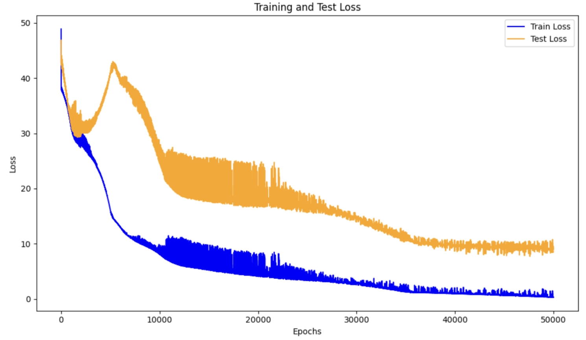

# Emergent-Behavior-in-Shallow-Neural-Networks-Trained-on-Cyclic-Labels
A research report analyzing epoch-wise double descent in a two-layer ReLU network trained on cyclic sinusoidal labels under hinge loss.

The report includes experiments on:

- AGOP regularization and grokking behavior

- variance and loss heatmaps across sample sizes

- antisymmetric initialization (ASI) experiments

- Neural Tangent Kernel (NTK) eigenspectrum analysis

- projections of hinge-loss gradients onto NTK eigenmodes

